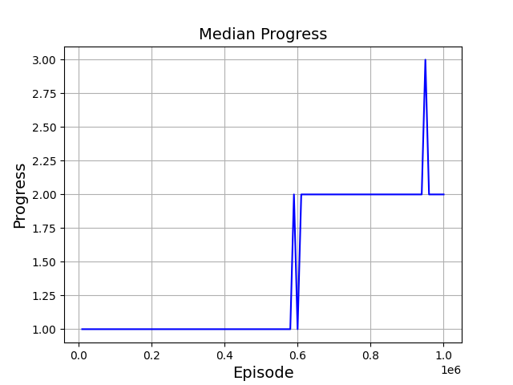

# Minesweeper solver using Q-learning Algorithm
  A 3x4 with 2 mines (States any normal computers can handle: almost equal 4^12 states ) 
  For any larger board, DQN can be used to solve it but since I'm trying to apply Q-learning to my new minesweeper environment, 3x4 with 2 mine will do just fine!
  
# Evaluating the Agent
        

# Statistics
  
  
  
  
  
