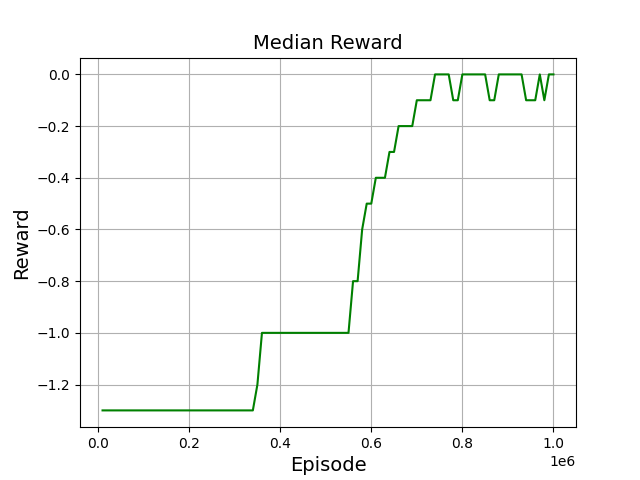
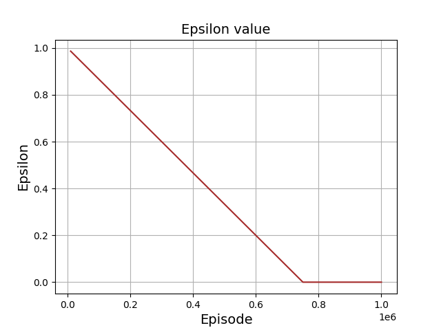

# Minesweeper solver using Q-learning Algorithm
  A 3x4 with 2 mines (States any normal computers can handle: almost equal 4^12 states ) 
  For any larger board, DQN can be used to solve it but since I'm trying to apply Q-learning to my new minesweeper environment, 3x4 with 2 mine will do just fine!
  
# Evaluating the Agent
From the below evaluations it might seem that the agent solves it every time after he was trained but I tried not to include the cases in which he steps on a mine at the first step since the first step it totally stochastic (the Agent found that the second step is not totally stochastic and he can win if the first revealed square has 2 mines as neighbours as in episode 45,000 which I’ve missed when calculating the max win rate he would reach! Which was 68.1% but the agent reached a win rate of 71%)

update: After training him for more episodes, the win rate reached 79%-80% which amazed me but at the end there is no magic here, just experience.

         

# Rewards/penalties
|Action  | Reward |
|--|--|
|open already revealed square  | -2 |
|stepping on a mine (game over!) | -1 |
|open random square |-0.3  |
|open a square that has revealed neighbours | -0.2 |
|win a game | 1 |

### Note: open a square that has revealed neighbours has a negaive reward for two reasons. To make it solve the game is less games as possible plus it's not always the right choice so it's better than random but not that good. 

# Statistics
   
